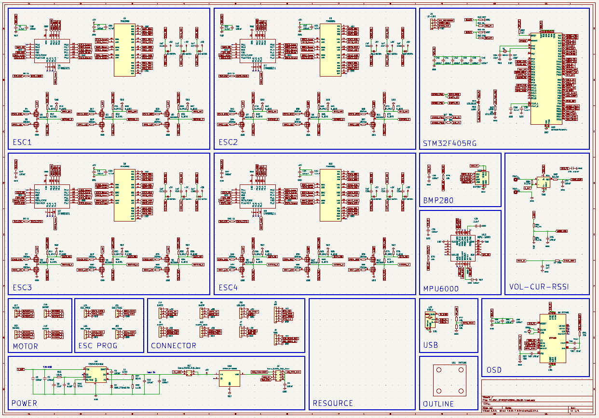
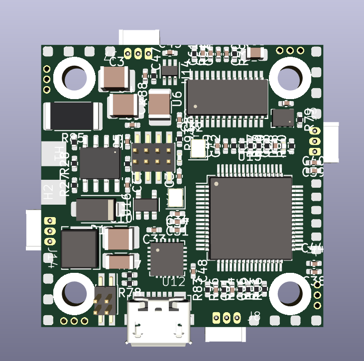
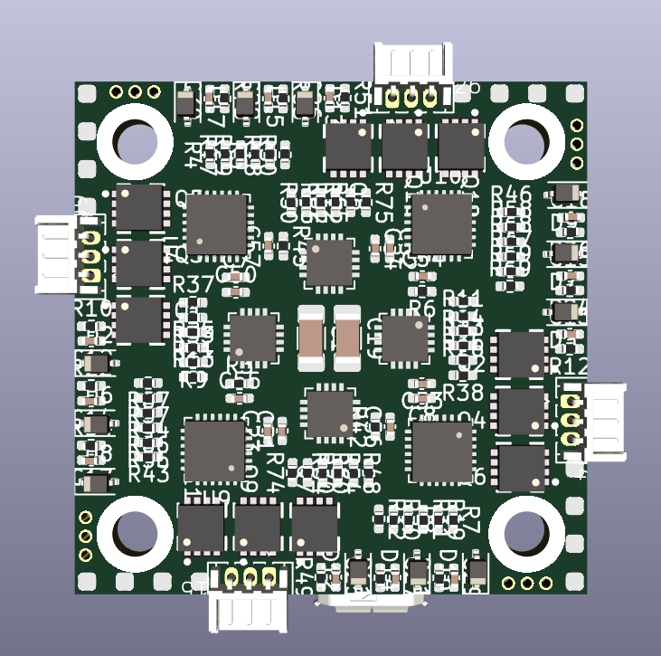

# FC_ESC_STM32F405RG_26x26

### 1. Overview

Hardware combine ESC and FC for quadcopter. STM32F405 is the main controller for FC and EFM8BB21 is the main controller for ESC. Dimension is 26x26 cm that compatible for almost tiny drone frame. 

Everything about this board: schematic, PCB gerber and BOM are free to distribute under open-source license for users.

### 2. Specifications

| Items               | Specifications                                               |
| ------------------- | ------------------------------------------------------------ |
| Power supply        | 5V micro USB Pin LiPo 2-4 cell                          |
| Microcontroller     | STM32F405RGT6 / 32-bit ARM Cortex-M4 with FPU(168MHz, 225DMIPS) |
| Sensors             | MPU6000 (3 axis gyroscope, 3 axis accelerometer)  BMP280 (barometer) |
| Programmer          | JTAG/SWD connector                                           |
| Communicaton Ports  | UART x 4 I2C x 1 SPI x 1                           |
| LEDs and buttons    | LED red: 3V3 power on LED blue: USER LED status         |
| Output power source | TPS5430 5V@5A RT9013 3V3                                |
| Dimensions          | 34 x34 mm                                                    |

**NOTE:**

This board use jumper to select 5V power source and to enalbe 3V3 power supply

### 3. Layout / Pin map

### 4. Hardware design

#### Schematic

#### 3D Top

#### 3D Bot

### 5. Bill of Materials (BOM)

### 6. Gerber
